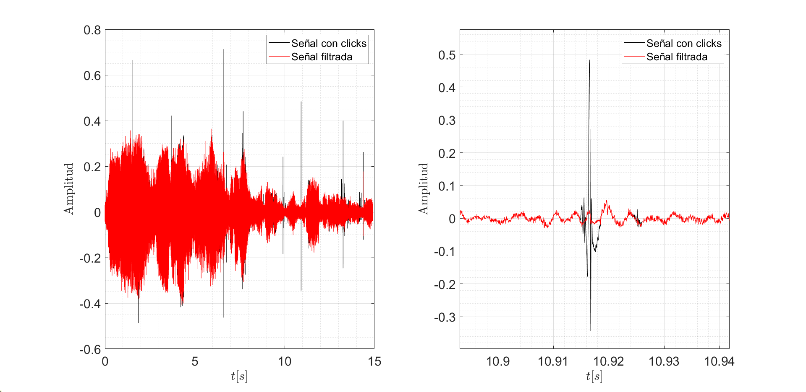

# Restoration of Analog Audio Recordings

This repo contains MATLAB files with both linear and non-linear filters capable of denoising digitalized audio files from vinyl record players with clicks. These anomalies are caused by the abrasive effect of diamond-tipped styluses on
the surface of said records. Sample audio files from real record players are also included.

*Original and denoised signal*

For more information on how this works, please refer to the PDF file.
